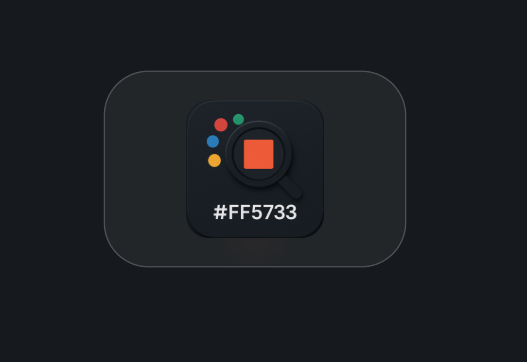
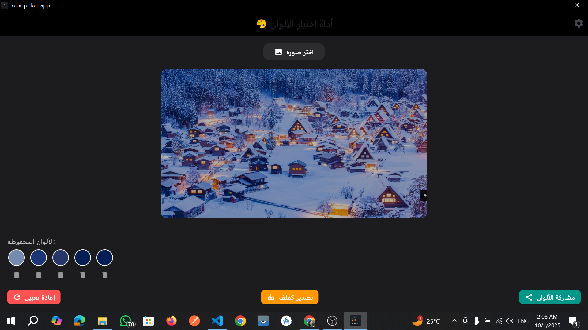

# 🎨 Color Picker Desktop – Flutter App  

  
  
  

---

⚡ **About the Project**  
A simple **desktop Flutter application** that allows users to **pick colors from images**, preview them, save them, and export them as HEX codes.  
Built for **designers, developers, and creative people** who need quick access to accurate color values.  

## 🎬 Demo Video  

👉 [Watch Demo](https://drive.google.com/drive/folders/1OCWmvhE19iwk6IknGgLRRb7l5BrYuQwr?usp=drive_link)  

---


## 🖼️ App Assets  

- **App Logo**  
    

- **Main App UI**  
    

---

## 📦 Project Structure  


lib/ 
   # Flutter source code
 core/
   # Models, utilities, localization
 providers/
   # Riverpod providers & state management
 veiw/
    widgets/ 
   # Custom reusable widgets
Assets/ 
 # Screenshots & images for docs


---


## ⚡ Features  

- 📷 Pick an image from local files  
- 🎨 Select colors by clicking on the image  
- 🔍 Preview live color under the cursor  
- 💾 Save colors with smooth animation  
- 📋 Copy HEX color codes to clipboard  
- 📂 Export saved colors to file (`saved_colors.txt`)  
- 🔗 Share saved colors via system share dialog  
- 🌐 Multi-language support (via localization)  

---
## 📌 Screenshots (Grid) 

<div style="display: flex; flex-wrap: wrap; gap: 10px;"> 
  
  
</div>
---


## ✅ Usage  

- Click **Choose Image** to load a picture
- Hover over the image to **preview color**
- Click to **select color**
- Save or export your color palette

---

## 📖 How to Run  

1. **Clone the repository**  
```bash
   git clone https://github.com/your-username/color-picker.git
   cd real-estate-ui
```

2. **Install dependencies**  

```bash
flutter pub get
```

3. **Run the project**  

Run on Windows:

```bash
flutter run -d windows  
```

Run on Linux:

```bash
flutter run -d linux
```

---

## ☕ Support the Project

If you find **Flutter Gradle Doctor** useful and want to support its development, you can buy me a coffee:

[](https://www.buymeacoffee.com/Mohamed_Fawzy)


